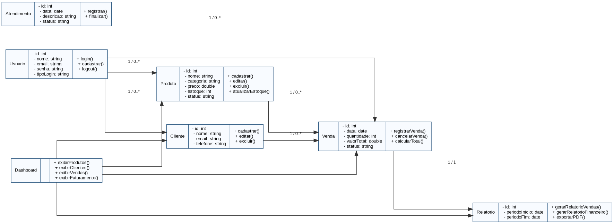
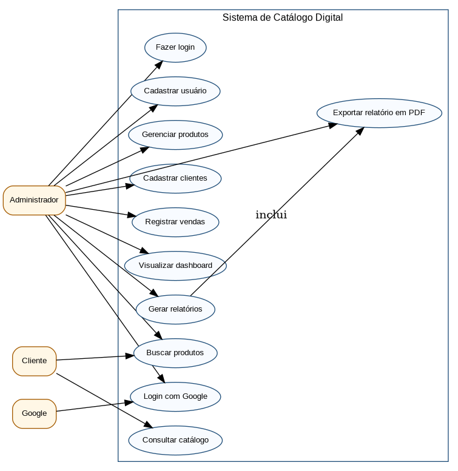
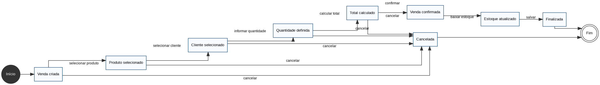
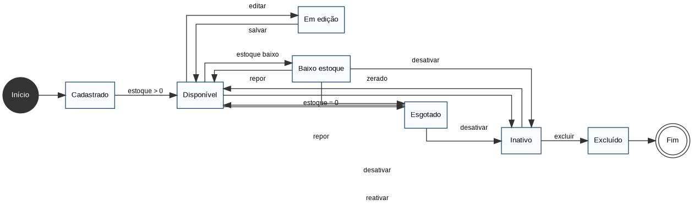
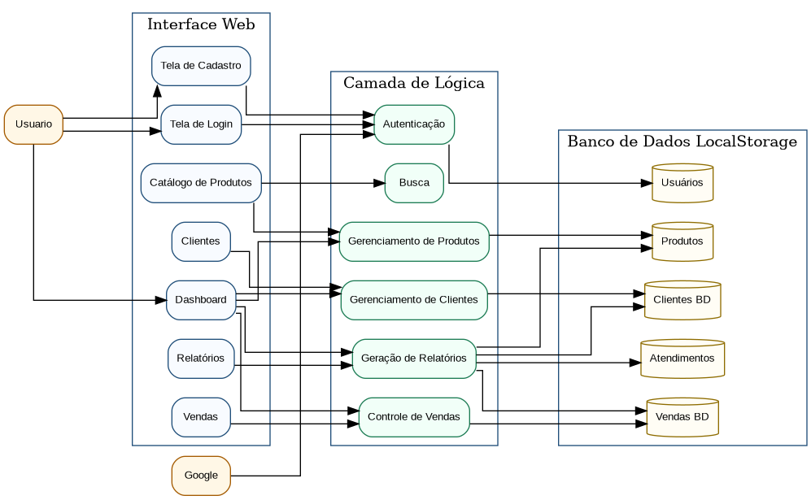

# Catálogo Digital - Sistema de Gestão de Produtos


## Sobre o projeto

O Catálogo Digital é um sistema web desenvolvido em HTML, CSS e JavaScript para organizar produtos, clientes, vendas, atendimentos e relatórios de uma loja.

O projeto possui interface responsiva, dashboard administrativo, autenticação, cadastro de usuários, busca, banco de dados local funcional e geração de relatório em PDF.


## Melhorias Visuais para Publicação

O sistema foi atualizado para publicação profissional na Netlify, incluindo:

- Favicon personalizado em SVG.
- Logo própria do sistema.
- Ícones reais na navegação lateral, login Google, modo escuro e saída.
- Imagens ilustrativas nos cards de produtos.
- Layout responsivo aprimorado para celular, tablet e computador.
- Interface com sombras, gradientes, cards modernos e melhor hierarquia visual.
- Ajustes de acessibilidade com textos alternativos nas imagens.

## Demonstração Online

O sistema ficará disponível na Netlify pelo endereço:

https://catalagogest.netlify.app

---

## Funcionalidades

- Tela de login.
- Tela de cadastro.
- Login com Google simulado.
- Dashboard funcional.
- Cadastro, edição, exclusão e busca de produtos.
- Cadastro e gerenciamento de clientes.
- Registro de vendas.
- Controle de estoque.
- Registro de atendimentos.
- Relatórios financeiros.
- Relatório em PDF.
- Banco de dados com LocalStorage.
- Interface organizada e responsiva.

## Tecnologias utilizadas

- HTML5.
- CSS3.
- JavaScript.
- LocalStorage.
- jsPDF.
- Chart.js.
- Font Awesome.

## Estrutura de pastas

```plaintext
catalogo-digital/
│
├── assets/
├── docs/
│   ├── diagramas/
│   │   ├── diagrama-classes.puml
│   │   ├── caso-de-uso.puml
│   │   ├── estado-venda.puml
│   │   ├── estado-produto.puml
│   │   └── diagrama-geral.puml
│   │
│   ├── imagens/
│   │   ├── diagrama-classes.png
│   │   ├── caso-de-uso.png
│   │   ├── estado-venda.png
│   │   ├── estado-produto.png
│   │   └── diagrama-geral.png
│   │
│   ├── DOCUMENTACAO.md
│   └── RELATORIO_DO_SISTEMA.pdf
│
├── index.html
├── style.css
├── script.js
├── README.md
└── .gitignore
```

## Como executar o projeto

1. Baixe ou clone este repositório.

```bash
git clone https://github.com/seuusuario/catalogo-digital.git
```

2. Acesse a pasta do projeto.

```bash
cd catalogo-digital
```

3. Abra o arquivo `index.html` no navegador.

Também é possível executar com a extensão Live Server no VS Code.

## Acesso ao sistema

O sistema permite criar uma nova conta diretamente pela tela de cadastro.

Também possui login com Google simulado para apresentação acadêmica. Para uso real, recomenda-se integrar o projeto ao Firebase Authentication.

## Banco de dados

O banco de dados utilizado nesta versão é o LocalStorage do navegador.

Ele armazena:

- Usuários.
- Produtos.
- Clientes.
- Vendas.
- Atendimentos.
- Relatórios.

Para uma versão profissional, o sistema pode ser adaptado para MySQL, Firebase, MongoDB ou PostgreSQL.

## Relatórios do sistema

O sistema gera informações como:

- Quantidade de produtos cadastrados.
- Quantidade de produtos vendidos.
- Número de clientes cadastrados.
- Quantidade de atendimentos.
- Faturamento total.
- Vendas registradas em determinado período.

Exemplo:

> A loja vendeu 35 produtos em 15 dias, gerando um faturamento de R$ 2.450,00.

## Diagramas UML

### Diagrama de Classes



### Diagrama de Caso de Uso



### Diagrama de Estado da Venda



### Diagrama de Estado do Produto



### Diagrama Geral do Sistema



## Arquivos dos diagramas

Os arquivos editáveis dos diagramas estão disponíveis na pasta:

```plaintext
docs/diagramas/
```

Esses arquivos estão no formato `.puml` e podem ser editados no PlantUML.

## Requisitos atendidos

| Requisito | Status |
|---|---|
| Dashboard funcional | Sim |
| Tela de login | Sim |
| Login com Google | Sim |
| Tela de cadastro | Sim |
| Banco de dados | Sim |
| Sistema de busca | Sim |
| Relatórios | Sim |
| Interface organizada | Sim |
| Repositório GitHub | Sim |
| Diagramas UML | Sim |
| Relatório em PDF | Sim |
| Documentação | Sim |

## Como publicar no GitHub

```bash
git init
git add .
git commit -m "Primeira versão do Catálogo Digital"
git branch -M main
git remote add origin https://github.com/seuusuario/catalogo-digital.git
git push -u origin main
```

## Desenvolvido por

Amanda Félix Veras  
Curso Técnico em Desenvolvimento de Sistemas  
EEEP Alfredo Nunes de Melo

## Licença

Este projeto está licenciado sob a licença MIT.

## Atualizações de Interface

- Responsividade revisada para desktop, tablet e celular.
- Navbar fixa no topo do sistema.
- Navbar oculta automaticamente ao rolar a página para baixo.
- Navbar reaparece ao mover o cursor para a área superior da tela.
- Tradução disponível em Português do Brasil, Inglês, Espanhol e Italiano.
- Seletor de idioma disponível na tela de login e no painel principal.
- Cadastro de produto com upload de imagem local.
